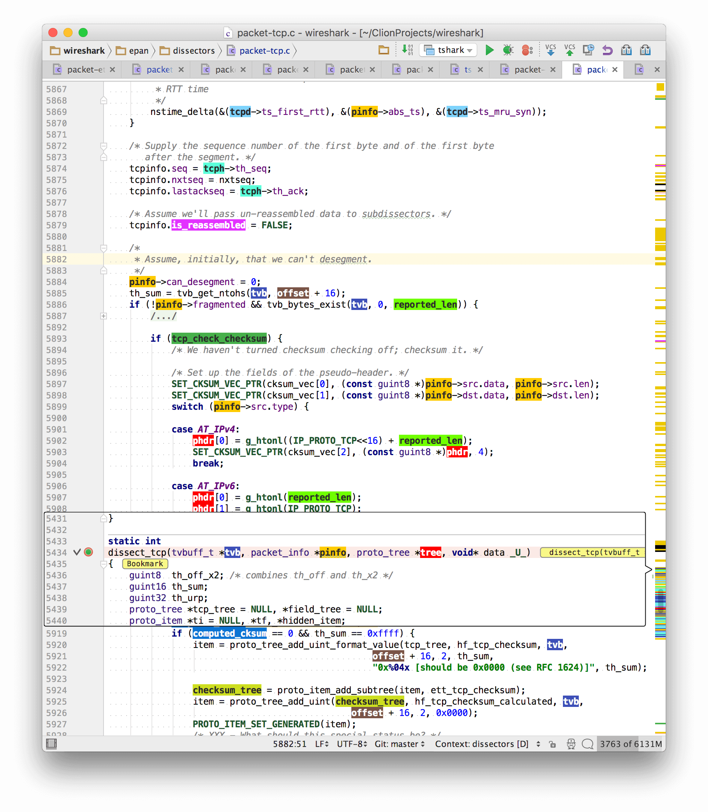
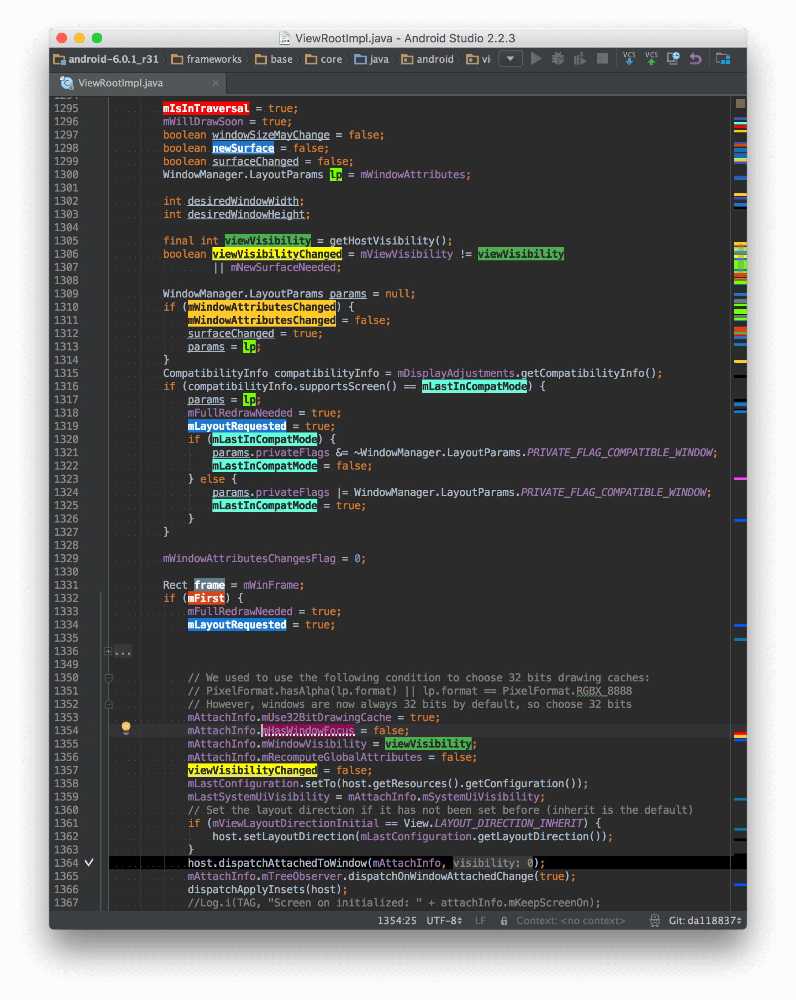

# MultiHighlight

[MultiHighlight](https://plugins.jetbrains.com/plugin/9511-multihighlight) lets you highlight identifiers with <b>custom colors</b> (like `Highlight Usages in File`), it's helpful when reading source code.

Default shortcut: <kbd>Ctrl</kbd>+<kbd>'</kbd> (or <kbd>⌘</kbd>+<kbd>'</kbd> on mac).

## Screenshots




## Install

+ Install MultiHighlight directly from the IDE: **File > Settings > Plugins > Browse Repositories... > search "MultiHighlight"**.
+ Install from [file](https://github.com/huoguangjin/MultiHighlight/releases).

## Customize

+ You can customize your highlight text style (bold/italic, foreground, background, stripe and effect style) in setting page.

    > Tips: Here is [material design color palette](palette.json), they are bright and vibrant colors. ([what is material design?](https://material.io/guidelines/style/color.html))

    

+ change the default keyboard shortcut: **File > Settings > Keymap > search "MultiHighlight"**.

    

+ If you like [IdeaVim](https://plugins.jetbrains.com/plugin/164), add following line to `~/.ideavimrc` and trigger MultiHighlight:

    ```vim
    " Press `'` to toggle highlight
    map ' :action MultiHighlight<CR>
    " Press `"` to clear all highlights in current editor
    map " :action MultiHighlight.ClearAction<CR>
    ```

## Build & Run

+ To build MultiHighlight, clone and run `./gradlew buildPlugin`.

+ To run IntelliJ IDEA with MultiHighlight installed, run ` ./gradlew runIde`.

## Change Log

- 1.0.0 first release.
- 1.0.1 one keystroke to clear all highlights in current editor.
